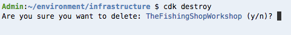

Cleanup
=======

In this section, we are going to clean up everything we made for this
workshop.

1. We first need clean up the Amazon S3 buckets. This is because you cannot
   delete a non-empty S3 bucket. This only works because we did not enable
   versioning on our buckets.

.. code-block:: bash
    :linenos:

    cd
    cd environment
    aws s3 rm s3://`./tools get_value DeploymentAssetsDeploymentBucket` --recursive
    aws s3 rm s3://`./tools get_value CDNStaticBucket` --recursive
    aws s3 rm s3://`aws s3 ls | grep thefishingshopworkshop-shopfrontendbucket | awk '{print $3}'` --recursive
    aws ec2 delete-key-pair --key-name FishingKey

2. With that done, we need to destroy the main stack.

.. Attention:: This will take an exceptionally long time (read: 30+ minutes)
               to run! You can leave this running and leave the workshop
               however as AWS Cloud9 will continue executing this in the
               background.

.. code-block:: bash
    :linenos:

    cd infrastructure
    cdk destroy

3. Go to the
   `AWS Cloud9 <https://console.aws.amazon.com/cloud9/home?region=us-east-1>`_
   console
4. Delete the Fishing environment.

You have now successfully cleaned up everything created by this workshop.
