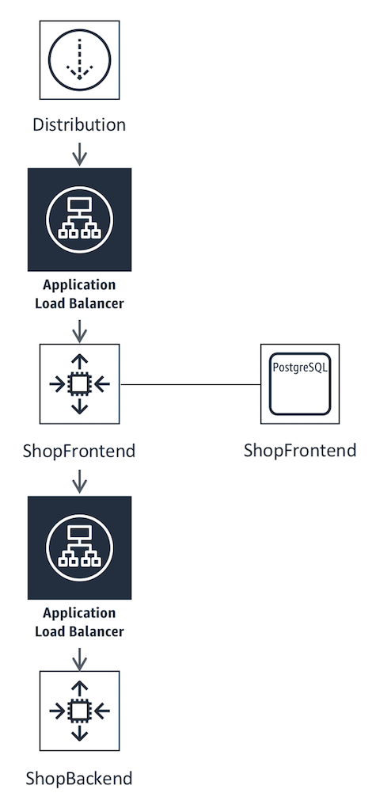

Exercise #0 - A few notes
=========================

At this point, you’ll notice within the AWS Cloud9 IDE that you a few sub
folders. Each of these folders represents a portion of our architecture,
which will be used and deployed at various points throughout the workshop.

As a result of the 'cdk deploy' command you ran in the last section, we've
also deployed an initial infrastructure stack. Below you can see a picture
of what is deployed so far. Alongside this, we also have a Bastion host
which we will be using throughout the subsequent exercises to access
items in the private subnet.

A few notes about the architecture we've deployed:

The 'Distribution' block is an content delivery distribution that leverages
`Amazon CloudFront`_. Amazon CloudFront is a fast content delivery network
(CDN) service that securely delivers data, videos, applications, and APIs to
customers globally with low latency, high transfer speeds, all within a
developer-friendly environment. CloudFront is integrated with AWS – both
physical locations that are directly connected to the AWS global
infrastructure, as well as other AWS services. CloudFront works seamlessly
with services including AWS Shield for DDoS mitigation, Amazon S3, Elastic
Load Balancing or Amazon EC2 as origins for your applications, and
Lambda-at-Edge to run custom code closer to customers’ users and to customize
the user experience.

This distribution will point to an `Application Load Balancer`_ which routes
traffic to the fishing shop's frontend application. An Application Load
Balancer functions at the application layer, the seventh layer of the Open
Systems Interconnection (OSI) model. After the load balancer receives a
request, it evaluates the listener rules in priority order to determine which
rule to apply, and then selects a target from the target group for the rule
action. You can configure listener rules to route requests to different
target groups based on the content of the application traffic. Routing
is performed independently for each target group, even when a target
is registered with multiple target groups.

At this point, the 'ShopFrontend' and 'ShopBackend' blocks are both deployed
using `AWS Elastic Beanstalk`_. With Elastic Beanstalk, you can quickly deploy
and manage applications in the AWS Cloud without worrying about the
infrastructure that runs those applications. AWS Elastic Beanstalk reduces
management complexity without restricting choice or control. You simply upload
your application, and Elastic Beanstalk automatically handles the details of
capacity provisioning, load balancing, scaling, and application health
monitoring.

.. _Amazon CloudFront : https://docs.aws.amazon.com/AmazonCloudFront/latest/DeveloperGuide/Introduction.html
.. _Application Load Balancer : https://docs.aws.amazon.com/elasticloadbalancing/latest/application/introduction.html
.. _AWS Elastic Beanstalk : https://docs.aws.amazon.com/elasticbeanstalk/latest/dg/Welcome.html
