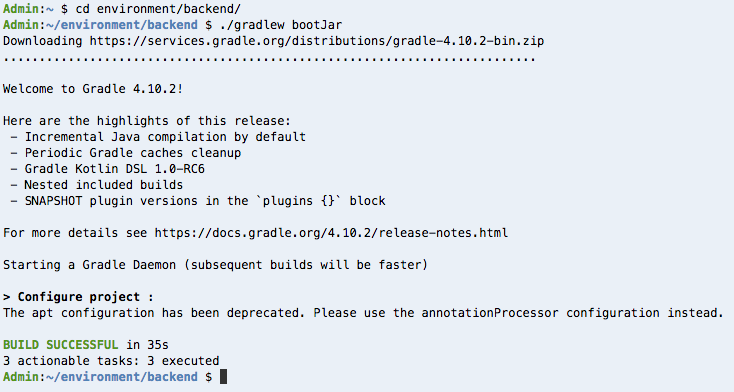

Exercise #1
===========

In this Exercise, we are going to deploy a fairly basic web application.
The application consists of a simple frontend written in `Python 3.6`_
using a framework called `Django`_ and a backend order processor written
in Java 8 using `Spring Boot`_.

We're doing this as a foundation of the upcoming exercises and gives us
something to break apart in the following tasks of this workshop.

Part 1 – Configure Amazon CloudFront to point to our environments
-----------------------------------------------------------------

When we deployed the CDK code in Exercise #0, it did not point our Amazon
CloudFront distribution at our AWS ElasticBeanstalk environment; instead
it was set to use an AWS S3 Bucket.  In a typical deployment model, this
would be handle by the CDK or CloudFormation template; in this instance,
we'll do it manually to avoid wait conditions that extend deployment time.
The following steps will modify the CloudFront distribution to point to our
deployed application

1. In the AWS Cloud9 Terminal get the value for setting up Amazon
   CloudFront by using the following commands and then copy it into your
   clipboard using ⌘-C (Ctrl-C on Windows)

   .. code-block:: bash
        :linenos:

        cd
        cd environment
        ./tools get_value ShopFrontendShopUrl

2. Go to `Services -> CloudFront`_ in another tab - you can hold ⌘ (Ctrl
   on Windows) and Click the link to achieve that quickly.
3. Click the distribution ID (starts with an E) of the Distribution that
   points to an origin starting with ‘thefishing’ – it’s the only one if
   this is a fresh account.
4. Click Origins and then Create Origin
5. Paste in the value you copied in step 1 into the Origin Domain Name
   field and hit TAB, or select it in the list.
6. In Origin ID, change the value to ShopFrontend. Make sure you leave Origin
   Path **empty**.
7. Leave everything else as a default and click on Create
8. Click Behaviors, select the first behavior and then click edit
9. Change the Origin drop down to ShopFrontend.
10. For the Object Caching field, select `Use Origin Cache Headers`
11. Scroll down and and click 'Yes, Edit'
12. If you now copy and paste the domain name from the `General Tab` into a
    new browser tab you should see something like the following:

    .. image:: images/elasticbeanstalk.png

Part 2 – Deploy the Frontend
----------------------------

.. Attention:: Each step here has a screenshot of the output. When the script
               says `Checking for status Ready` followed by 'Environment
               reached status required'. This means it completed.

               Expect to wait 3-5 minutes during these Checking steps.

In the AWS Cloud9 Terminal:

.. code-block:: bash
    :linenos:

    cd
    cd environment/frontend
    zip -r ../frontend.zip .

This creates a zip file with the contents of the website. That's all we need
for AWS ElasticBeanstalk to deploy the website. If you're interested in the
configuration parameters being passed to AWS Elastic Beanstalk, take a look
at the 'frontend/.ebextensions/aws.config' file. This file lays out the
deployment parameters that define the stack that will be defined. For more
information on AWS Elastic Beanstalk configuration, please see the
`documentation <https://docs.aws.amazon.com/elasticbeanstalk/latest/dg/beanstalk-environment-configuration-advanced.html>`_.

We now need to set the Database URL for the application. This wasn't done by
the AWS CDK code we used to deploy our application so that we could save time
in the setup of the workshop, and deploy various elements of the architecture
in parallel. In a standard deployment, this step could be handled by
CloudFormation and/or CDK.

.. tabs::

    .. group-tab:: Tools Script

        .. code-block:: bash
            :linenos:

            cd ~/environment
            ./tools set_database_url

        .. Attention:: When the script says `Checking for status Ready` followed by
            'Environment reached status required'. This means it completed.

            Expect to wait 3-5 minutes during these Checking steps.

        .. image:: images/frontend_database_url.png

    .. group-tab:: AWS CLI

        .. note:: Copy/Paste this following block in one go as the `aws`
                  command is multi-line

        .. code-block:: bash
            :linenos:

            cd ~/environment
            aws elasticbeanstalk update-environment \
                --environment-name ShopFrontend \
                --option-settings Namespace=aws:elasticbeanstalk:application:environment,OptionName=DATABASE_URL,Value=`./tools get_value ShopFrontendDjangoDatabaseUrl`

        You now need to wait for the environment to stabilize. You can find
        the current status by doing the following and waiting for it to say
        `Ready`. Again, this is multiple lines and so copy/paste it in one
        go. The `jq` command here is simply extracting just the Status so
        we can quickly see what it is.

        .. code-block:: bash
            :linenos:

            aws elasticbeanstalk describe-environment-health \
                --environment-name ShopFrontend \
                --attribute-names Status | jq -r .Status

Now we have set the Database URL, we need to upload the zip file we created
into Amazon S3 ready for deployment into AWS ElasticBeanstalk.

.. tabs::

    .. group-tab:: Tools Script

        .. code-block:: bash
            :linenos:

            ./tools upload_frontend frontend.zip v1

        .. image:: images/frontend_upload.png

    .. group-tab:: AWS CLI

        .. note:: Copy/paste this in one go

        .. code-block:: bash
            :linenos:

            aws s3 cp frontend.zip s3://`./tools get_value DeploymentAssetsDeploymentBucket`/v1_frontend.zip
            aws elasticbeanstalk create-application-version \
                --application-name ShopFrontend \
                --version-label v1 \
                --source-bundle S3Bucket=`./tools get_value DeploymentAssetsDeploymentBucket`,S3Key=v1_frontend.zip

With the zip file uploaded to Amazon S3, we can now run a command to deploy
the ShopFrontend to AWS ElasticBeanstalk.

.. Attention:: When the script says `Checking for status Ready` followed by
               'Environment reached status required'. This means it completed.

               Expect to wait 3-5 minutes during these Checking steps.

.. tabs::

    .. group-tab:: Tools Script

        .. code-block:: bash
            :linenos:

            ./tools deploy_frontend v1

        .. image:: images/frontend_deploy.png

    .. group-tab:: AWS CLI

        .. note:: Copy/paste this in one go

        .. code-block:: bash
            :linenos:

            aws elasticbeanstalk update-environment \
                --environment-name ShopFrontend \
                --version-label v1

        You now need to wait for the environment to become Ready again. You
        can use the snippet below to do that. Keep repeating this command
        until you get `Ready` as a response.

        .. code-block:: bash
            :linenos:

            aws elasticbeanstalk describe-environment-health \
                --environment-name ShopFrontend \
                --attribute-names Status | jq -r .Status

Because we are using a CDN distribution leveraging Amazon CloudFront, we
now need to make sure that CloudFront knows we updated the site. We'll do
this by creating a cache invalidation to make sure the distribution gets
updated with the latest reponses. We can do this from CLI rather than the
console. We'll go through how to do this in the console in a Exercise #3.

.. code-block:: bash
    :linenos:

    aws cloudfront create-invalidation --distribution-id `./tools get_value CDNCloudFrontDistribution` --paths /

Part 3 – Deploying the Backend
------------------------------

.. Attention:: Each step here has a screenshot of the output. When the script
               says `Checking for status Ready` followed by 'Environment
               reached status required'. This means it completed.

               Expect to wait 3-5 minutes during these Checking steps.

Let's go ahead and build the Java backend. In the AWS Cloud9 Terminal:

.. code-block:: bash
    :linenos:

    cd
    cd environment/backend
    ./gradlew bootJar

We have now compiled the Backend .jar file ready for deployment. We now need
to upload this file to Amazon S3 ready for deployment.

.. tabs::

    .. group-tab:: Tools Script

        .. code-block:: bash
            :linenos:

            cd ..
            ./tools upload_backend backend/build/libs/backend-0.0.1-SNAPSHOT.jar v1

        .. image:: images/backend_upload.png

    .. group-tab:: AWS CLI

        .. note:: Copy/paste this in one go

        .. code-block:: bash
            :linenos:

            cd ..
            aws s3 cp backend/build/libs/backend-0.0.1-SNAPSHOT.jar s3://`./tools get_value DeploymentAssetsDeploymentBucket`/v1_backend.jar
            aws elasticbeanstalk create-application-version \
                --application-name ShopBackend \
                --version-label v1 \
                --source-bundle S3Bucket=`./tools get_value DeploymentAssetsDeploymentBucket`,S3Key=v1_backend.jar

With the backend jar file uploaded to Amazon S3, we can now go ahead and deploy
it to AWS ElasticBeanstalk.

.. tabs::

    .. group-tab:: Tools Script

        .. code-block:: bash
            :linenos:

            ./tools deploy_backend v1

        .. image:: images/backend_deploy.png

    .. group-tab:: AWS CLI

        .. note:: Copy/paste this in one go

        .. code-block:: bash
            :linenos:

            aws elasticbeanstalk update-environment \
                --environment-name ShopBackend \
                --version-label v1

        You now need to wait for the environment to become Ready again. You
        can use the snippet above to do that. Keep repeating this command
        until you get `Ready` as a response.

        .. code-block:: bash
            :linenos:

            aws elasticbeanstalk describe-environment-health \
                --environment-name ShopBackend \
                --attribute-names Status | jq -r .Status

You have now deployed our basic Front and Back services to allow our shop
to function in its basic form. We should now test this and make sure it works
before continuing.

.. _Services -> CloudFront : https://console.aws.amazon.com/cloudfront/home?region=us-east-1#
.. _Python 3.6 : https://www.python.org
.. _Django : https://www.djangoproject.com
.. _Spring Boot : http://spring.io/projects/spring-boot

.. centered:: **Exercise #1 is complete, click Next below to continue**
