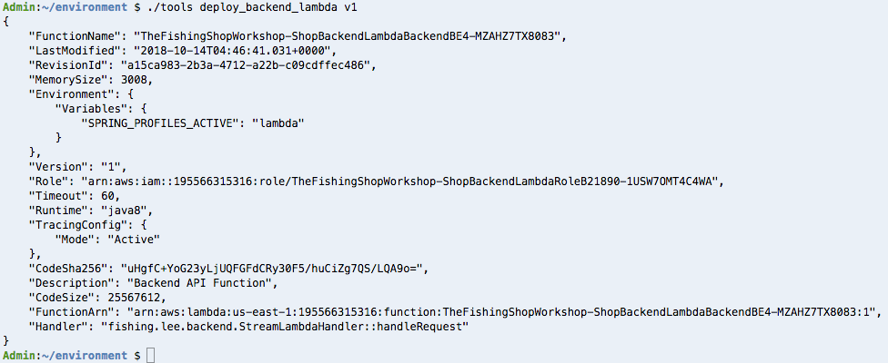
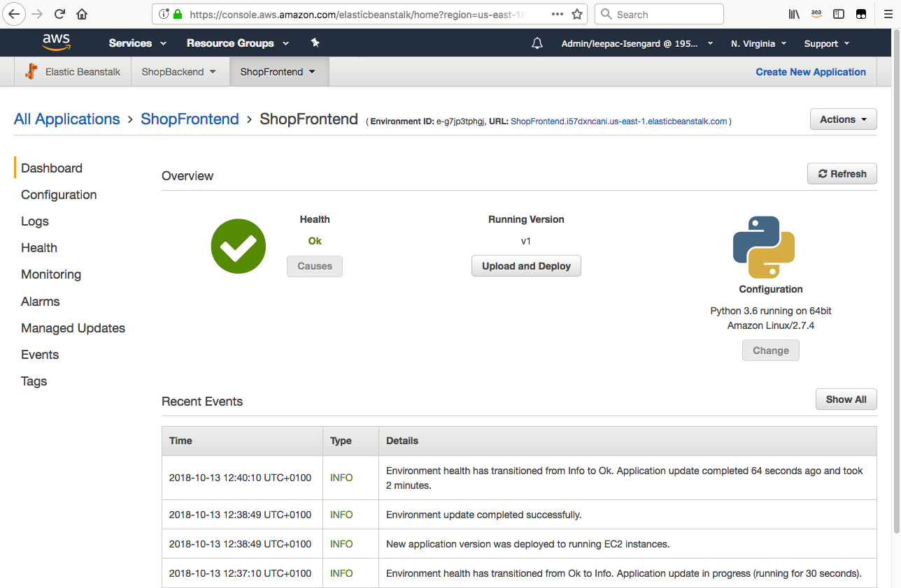
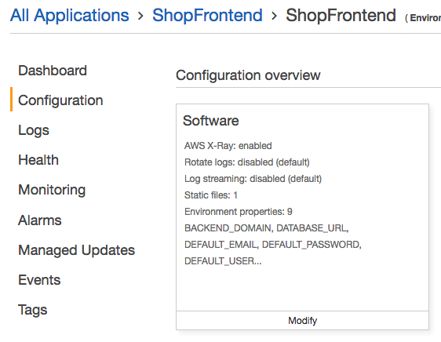

Exercise #2
===========

As referenced in the workshop introduction, we're expecting a great deal of
traffic in the near of future. By leveraging `Amazon EC2 Auto Scaling Groups`_,
we can configure them to react to our traffic. An Auto Scaling group contains
a collection of EC2 instances that share similar characteristics and are
treated as a logical grouping for the purposes of instance scaling and
management. For example, if a single application operates across multiple
instances, you might want to increase the number of instances in that group
to improve the performance of the application, or decrease the number of
instances to reduce costs when demand is low. You can use the Auto Scaling
group to scale the number of instances automatically based on criteria that
you specify, or maintain a fixed number of instances even if an instance
becomes unhealthy.

We can also use `Amazon CloudWatch`_ to define custom scaling metrics to reduce
the amount of time it takes to respond or even schedule these scaling tasks.
Amazon CloudWatch is a monitoring and management service built for developers,
system operators, site reliability engineers (SRE), and IT managers.
CloudWatch provides you with data and actionable insights to monitor your
applications, understand and respond to system-wide performance changes,
optimize resource utilization, and get a unified view of operational health.
CloudWatch collects monitoring and operational data in the form of logs,
metrics, and events, providing you with a unified view of AWS resources,
applications and services that run on AWS, and on-premises servers.

`AWS Lambda`_ does this for you and scales your workload automatically based on
demand. With Lambda, you can run code for virtually any type of application
or backend service - all with zero administration. Just upload your code
and Lambda takes care of everything required to run and scale your code
with high availability. You can set up your code to automatically trigger
from other AWS services or call it directly from any web or mobile app.

We can run our existing service in AWS Lambda using the
`AWS Serverless Java Container`_ available on GitHub. It supports Spring Boot,
which means that we can use it to run our service without changing our
business logic.

In order to expose the backend Java Lambda function via HTTP, we'll also need
to leverage `API Gateway`_. Amazon API Gateway is an AWS service that enables
developers to create, publish, maintain, monitor, and secure APIs at any
scale. You can create APIs that access AWS or other web services, as well
as data stored in the AWS Cloud.

We are going to deploy the same code base we used in Exercise #1 with only a
small change to the way we are building the code. Specifically,

**Let's see what we have right now**

Before we start, make sure you're in the Cloud9 Terminal and not still logged
into your Bastion. You can do this by hitting Enter/Return in the terminal a
couple of times. If the prompt is in colour, then you're set! If not, type
`logout` and press Enter to get back to it.

If you find that the tab disappears if you do that... Use Window -> New
Terminal.

1. In the AWS Cloud9 Terminal get the value for API by using the following
   commands and then copy it into your clipboard using ⌘-C (Ctrl-C on
   Windows)

.. code-block:: bash
   :linenos:

   cd
   cd environment
   ./tools get_value ShopBackendRestApiUrl

2. Copy the value outputted into your clipboard
3. Let's SSH into the Bastion and see what the API returns

.. code-block:: bash
   :linenos:

   ./tools ssh_to_bastion

.. code-block:: bash
   :linenos:

   curl <url from above>/ping

You should see `DUMMY /ping` come back as a response.

.. Hint:: This proves that the placeholder Lambda is deployed rather than
          our proper backend service. We'll be deploying that next.

3. Type `logout` and press Enter/Return to get back to Cloud9.

Now let's build the Backend for AWS Lambda. It's a slightly different build
process to prepare it for deployment to AWS Lambda, but no code changes are
required.

4. Run the following commands to build the Java application JAR for AWS
Lambda, and to initiate the upload of the JAR for use by our function:

.. code-block:: bash
    :linenos:

    cd ~/environment/backend
    ./gradlew shadowJar
    cd ~/environment
    ./tools upload_backend_lambda backend/build/libs/backend-0.0.1-SNAPSHOT-all.jar v1

5. Now that we've built the application for AWS Lambda, let's deploy our
   function:

.. code-block:: bash
    :linenos:

    ./tools deploy_backend_lambda v1

6. Excellent! We've deployed the code to a Lambda function, fronted by API
   Gateway. Let's test it!

.. code-block:: bash
    :linenos:

    ./tools get_value ShopBackendRestApiUrl

7. Copy the value outputted into your clipboard
8. Now let's test the API again:

.. code-block:: bash
   :linenos:

   ./tools ssh_to_bastion
   curl <url from above>/ping

You should see just `PONG` instead of `DUMMY`.

.. Note:: If you get Empty reply from server, just wait a few seconds
          and try again.

9. Log out from the Bastion using `logout` or pressing CTRL + D

Now that we've deployed our backend code to a AWS Lambda, we need to point
our ShopFrontend at this new API! You can do this via the Console or via
the CLI. The CLI version of the instructions below will fix any mistakes
you made in the console, so why not give this a go?

**Console**

1. The tools script has a helper to get the parameters you need:

.. code-block:: bash
   :linenos:

   ./tools get_rest_api_components

Leave the output there in this tab so you can use it in the following
instructions.

2. Open a new tab and go to the `AWS Elastic Beanstalk`_ console.
3. Click on the large ShopFrontend box (hopefully it's green! If it isn't
   put your hand up for a Solutions Architect to give you a hand)

4. Click `Configuration` and then head to Modify on the Software box.

5. Scroll down to Environment properties
6. You'll need to update BACKEND_DOMAIN with the output from step 1
7. Create two new variables for BACKEND_PROTOCOL and BACKEND_URI_PREFIX using
   the empty boxes at the bottom; as you enter the first one, another box will
   appear. Use values from the output of Step 1 to fill in the respective new
   entries.

8. Click Apply and you'll be told it's updating. If you head to the Dashboard
   you can wait for it to go back to Health `Ok`.

.. _AWS Elastic Beanstalk : https://console.aws.amazon.com/elasticbeanstalk/home?region=us-east-1#/applications

**CLI**

You tried, or didn't try the Console approach and want the script to do it for
you? No problem!

.. Attention:: When the script says `Checking for status Ready` followed by
               'Environment reached status required'. This means it completed.

               Expect to wait 3-5 minutes during these Checking steps.

.. code-block:: bash
   :linenos:

   ./tools set_backend_api_gateway

And wait! It'll tell you when it's done.

.. centered:: **Exercise #2 is complete, click Next below to continue and to test our work**

.. _AWS Serverless Java Container : https://github.com/awslabs/aws-serverless-java-container

.. _Amazon EC2 Auto Scaling Groups : https://docs.aws.amazon.com/autoscaling/ec2/userguide/AutoScalingGroup.html

.. _Amazon CloudWatch : https://docs.aws.amazon.com/AmazonCloudWatch/latest/monitoring/WhatIsCloudWatch.html

.. _AWS Lambda : https://docs.aws.amazon.com/lambda/latest/dg/welcome.html

.. _API Gateway : https://docs.aws.amazon.com/apigateway/latest/developerguide/welcome.html
