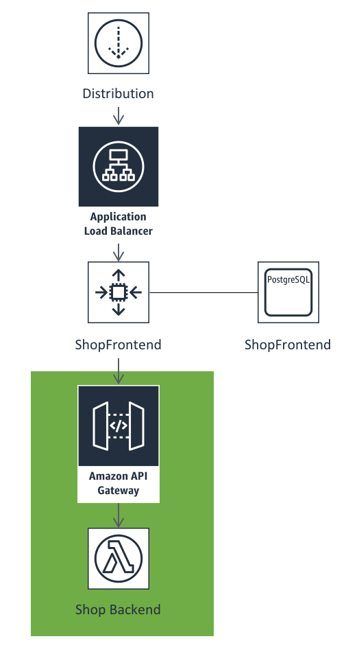

Exercise #2 - Checklist for completion
======================================

1. Pop over to the CloudFront service in the Console and copy the domain name
   for the Distribution and load it up in a new tab.
2. Click Rods and then the Muskie Casting Rod
3. Buy the item (it will make you sign up etc.)

.. Attention:: **DO NOT ENTER CREDIT CARD INFORMATION ON THIS FORM**

Below you can see a picture of how are architecture looks now. The area with
the green background is the area that has changed since our initial deployment.

Because we have replaced the existing service with an Amazon API Gateway and
a Lambda Function, we have more flexibity to override methods in our existing
service and benefit from AWS Lambda being in control of scaling. Because AWS
Lambda takes care of scaling for you, there's no need to configure Auto Scaling
Groups.
