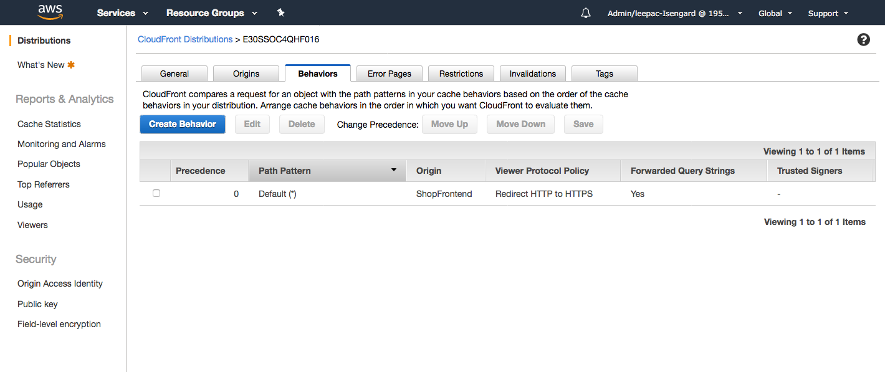
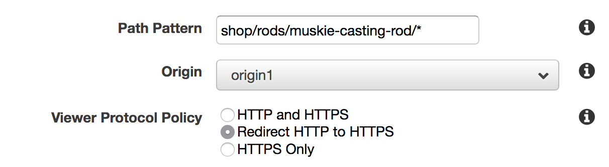
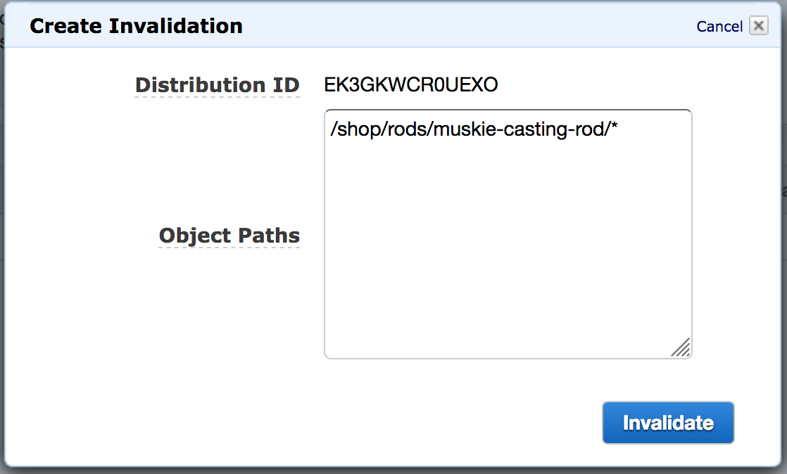
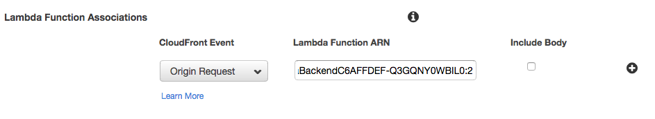

Exercise #3
===========

Our most popular product is the Muskie Casting Rod! We need to ensure that
people buying this product don’t cause our website to be overloaded and stop
other customers buying our Tourney Casting Rod.

Did you know that you can send AWS CloudFront traffic to different
destinations based on URI? We can achieve our goals by using a feature in AWS
CloudFront that allows for multiple origins and multiple behaviors and use
these to dictate how traffic reaches them.

Thankfully our initial deployment during Exercise #0 deployed an Amazon S3
Bucket already configured securely against our AWS CloudFront distribution.
You can read more about how this serves traffic from a Private S3 bucket in
the documentation at
`Restricting Access to Amazon S3 Content by Using an Origin Access Identity`_.

Part 1 - Split Origin CloudFront
--------------------------------

Before we get started we probably want to have some content in the bucket to
serve from. This **does not** mean that that content has to be in a public
bucket!

1. The static website needs building so, in the Cloud9 Console:

.. code-block:: bash
    :linenos:

    cd ~/environment/frontend_minisite
    yarn
    API_URL=`../tools get_value ShopBackendEdgeApiUrl`/ping yarn build

.. Note:: This last command can take 2-3 minutes to execute.

.. Attention:: During the last command you may see yellow WARNING lines about
               oversized assets - these can all be safely ignored.

We have now compiled our static website into a format suitable to be hosted.

2. We need to upload our static website to an Amazon S3 bucket:

.. code-block:: bash
    :linenos:

    cd dist
    aws s3 cp --recursive . s3://`~/environment/tools get_value CDNStaticBucket`/shop/rods/muskie-casting-rod

3. Go to `Services -> CloudFront`_ in another tab - you can hold ⌘ (Ctrl
   on Windows) and Click the link to achieve that quickly.
4. Click the distribution ID (starts with an E) you were working with earlier
   in Exercise #1.
5. Click the Behaviors tab.

6. Click `Create Behavior`
7. Enter `shop/rods/muskie-casting-rod/*` in the `Path Pattern field`
8. Select `origin1` as the Origin.
9. Select `Redirect HTTP to HTTPS` for `Viewer Protocol Behavior`
10. Leave everything else as the default and click `Create` at the bottom

11. Let's now guarantee nothing is cached by using an Invalidation. Click
    the `Invalidations` tab.
12. Click `Create Invalidation` and put in
    `/shop/rods/muskie-casting-rod/*` for the Object Path.
13. Click `Invalidate`.

14. Wait for the `In progress` to change to `Complete`. This takes a couple of
    minutes.
15. Browse to the Shop in another tab and go to Rods then click on the
    Muskie Casting Rod. It won't work properly and you'll get an Access
    Denied error. Let's go about fixing that.

Part 2 - Fixing our product page
--------------------------------

We better do this quickly as we've broken production! Oops!

The reason we got an error in the previous is because, when you request a URL
from the browser with nothing on the end, there is no document to serve. This
is normally something done by setting a Default Document. Although AWS S3
supports doing this if we were using S3 websites, we are not and so we need
to do this via `AWS Lambda@Edge <https://aws.amazon.com/lambda/edge/>`_.

1. In the Cloud9 Terminal

.. code-block:: bash
    :linenos:

    cd
    cd environment
    ./tools update_edge_lambda

This will upload a Lambda function which allows for us to show index.html as
a default item. Shown here is the code that we just uploaded to our Lambda
function.

.. code-block:: js

    'use strict';

    /**
    * Add index.html to the source uri to handle a default URI
    * in a single behaviour with other content.
    *
    * Taken from Ronnie Eichler's blog post:
    * https://aws.amazon.com/blogs/compute/implementing-default-directory-indexes-in-amazon-s3-backed-amazon-cloudfront-origins-using-lambdaedge/
    */
    exports.index_rewrite = (event, context, callback) => {
        // Extract the request from the CloudFront event that is sent to Lambda@Edge
        var request = event.Records[0].cf.request;

        // Extract the URI from the request
        var olduri = request.uri;

        // Match any '/' that occurs at the end of a URI. Replace it with a default index
        var newuri = olduri.replace(/\/$/, '\/index.html');

        // Replace the received URI with the URI that includes the index page
        request.uri = newuri;

        // Return to CloudFront
        return callback(null, request);
    };

2. The output from the first step will be some JSON. Grab the string for
    `FunctionArn` - it will look something like:

.. code-block:: bash
    :linenos:

    arn:aws:lambda:us-east-1:195566315316:function:TheFishingShopWorkshop-CDNLambdaBackendC6AFFDEF-Q3GQNY0WBIL0:2

.. Note:: The number appearing on the end is the version number.
          If there isn't a :2 at then likely you have the wrong entry from
          the output.

3. Go to `Services -> CloudFront`_ in another tab - you can hold ⌘ (Ctrl
   on Windows) and Click the link to achieve that quickly.
4. Click the distribution ID (starts with an E) of the Distribution that
   points to an origin starting with ‘thefishing’ – it’s the only one if
   this is a fresh account.
5. Click the Behaviors tab.

.. image:: images/cf_behaviors_2.png

6. You want to Edit Behavior which is the one we created in Part 1. It will
   have a path pattern starting with `shop`
7. Scroll down to Lambda Function Associations, select Origin Request as the
   Event Type in the `Select Event Type` drop down and then paste in the ARN
   you copied in Step 2 above.

8. Click `Yes, Edit`
9. Now head back to the `Services -> CloudFront`_ page and wait for the
   distribution status to change to Deployed - this may take 3-5 minutes but
   if it doesn't change after 5 minutes, feel free to continue.
10. Let's now guarantee nothing is cached by using an Invalidation. Click
    the `Invalidations` tab.
11. Select the Invalidation you already made and Click `Copy`.
12. Now click `Invalidate`.
13. Wait for the `In progress` to change to `Complete`. This takes a couple of
    minutes.

.. _Services -> CloudFront : https://console.aws.amazon.com/cloudfront/home?region=us-east-1#
.. _Restricting Access to Amazon S3 Content by Using an Origin Access Identity : https://docs.aws.amazon.com/AmazonCloudFront/latest/DeveloperGuide/private-content-restricting-access-to-s3.html
