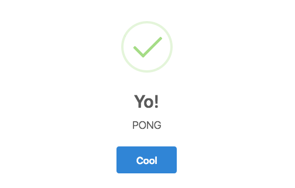
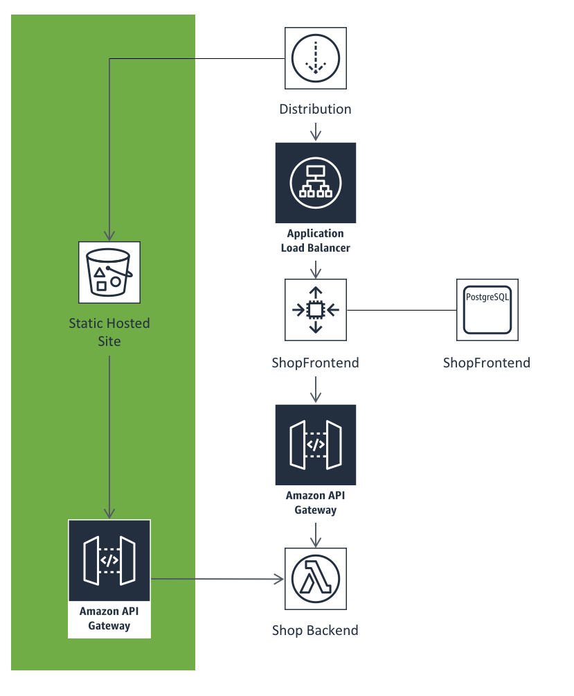

Exercise #3 - Checklist for completion
======================================

1. Pop over to the CloudFront service in the Console and copy the domain
   name for the Distribution and load it up in a new tab.
2. Click Rods and then the Muskie Casting Rod
3. The site will look completely different!
4. Click the `Sweet - Buy it now` button

5. You will see the PONG response above. If you don't then you might have
   missed a step. Go back through :doc:`exercise_3` and check you covered
   everything.

.. Note:: This is using a mock endpoint rather than the ordering endpoint.
          We're just showing how we can talk to our backend service via a
          different API Gateway.

You can see the updated architecture diagram below. The new areas are in
green. Of note is that the Lambda function is still within our VPC. We just
have a new API Gateway outside the VPC which the static site can talk to.

CORS is configured within the Lambda function rather than the API Gateway
because of how we are using Proxy support. This means the original service
is in full control.

We are also only diverting traffic to our most popular product via the static
website. This allows the shop to continue functioning the way it was for
full priced traffic. Essentially, we are helping with pressure points of the
shop.

.. Note:: If we were designing this architecture from scratch, we would
          certainly do things a little differently. But this demonstrates
          a viable way to migrate elements of the same application to
          cloud native architectures while while re-platforming.

