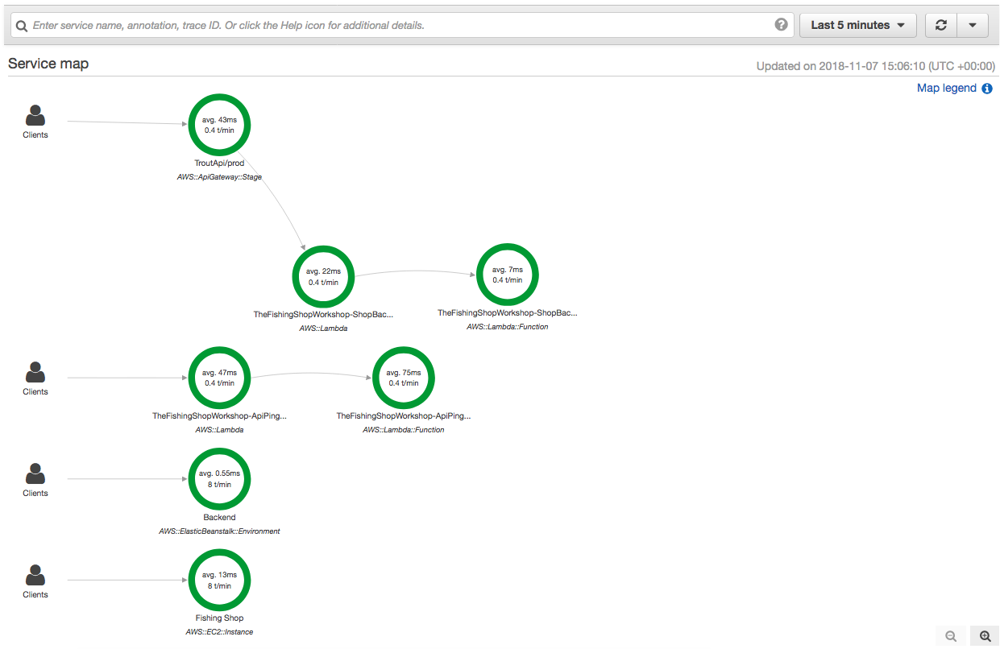
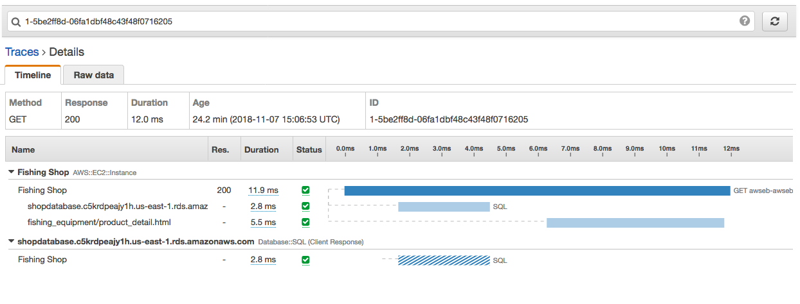
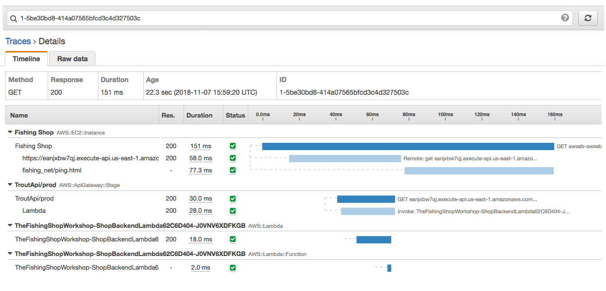

Exercise #4
===========

In this exercise we're going to explore some of the things that we have
created so far and how we can monitor them.

AWS X-Ray is a distributed tracing system. We can use it to have a look at
what is going on inside our new deployed setup. We can have a look at not only
our Frontend application but trace all the way through to our Backend API
within the same request.

To start with, make sure you have a Tab in a browser opened with the Shop in
it. If you can't remember how to do that, pop back to :doc:`exercise_1_post` to
find out how to load that from Step 4.

In another tab, open up
`AWS X-Ray <https://console.aws.amazon.com/xray/home?region=us-east-1>`_. You
can do this by holding down ⌘ (CTRL on Windows) and clicking the link.

By default AWS X-Ray will show a Service Map from the last 5 minutes.

    Click to expand sample AWS X-Ray Service Map Picture

On the left hand side, click `Traces <https://console.aws.amazon.com/xray/home?region=us-east-1#/traces>`_.

This will display a lot of information, but we can filter this. Let's test
this:

In the main search box, enter the following:

::

    http.url ENDSWITH "baitcasting-reel/"

What this will do is only so traces where the URL ends in baitcasting-reel; so
within the Shop browse Reels and then Baitcasting Reel.

Go back to the tab with AWS X-Ray in it and click refresh and you will see an
item in the Trace List. Now click it and you'll see the detail behind the
trace.

You can see within the trace that not only does it show how long the page took
to load, but also the SQL query. Let's go a bit further and see what a call
to the backend looks like.

Go back and replace the search box with:

::

    http.url ENDSWITH "basket/ping"

Go to the shop tab and browse to `/basket/ping` by putting the URL in the
browser directly. It should be `https://<the domain>/basket/ping`.

You should see a response that says: `Artifishial Intelligence says: PONG`.

Now go back to the X-Ray tab and tap refresh, you'll see a trace and if you
click into it you'll see something like this:

What's good here is that you can see the call through the API Gateway through
to the Lambda function. If the Lambda function (our Backend service) was then
to call services like Amazon RDS or Amazon DynamoDB, you would see that here.

This exercise scratches the surface of the kinds of tracing you can do with
AWS X-Ray. You can find more information about X-Ray on the AWS website.
