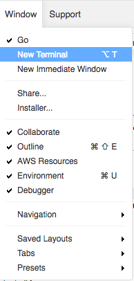
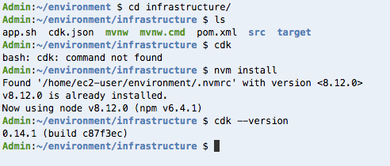
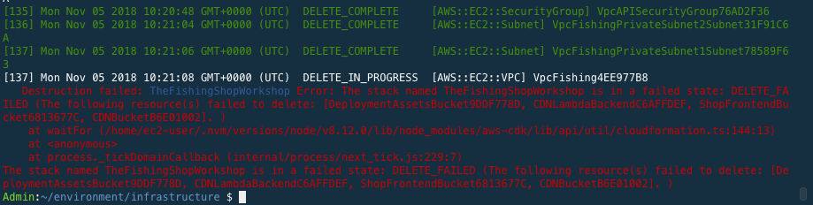

Troubleshooting
===============

General
-------

**I lost my terminal in the Cloud9 Window**

In the Cloud9 menus, go to the Window menu and New Terminal.

Exercise #0
-----------

**When typing ./tools create_ssh_key I get an error**

You got this?

::

    An error occurred (InvalidKeyPair.Duplicate) when calling the CreateKeyPair operation: The keypair 'FishingKey' already exists.
    Key created and secured

No problem! Do the following:

1. Go to `Services -> EC2 -> Key Pairs <https://console.aws.amazon.com/ec2/v2/home?region=us-east-1#KeyPairs:sort=keyName>`_.
2. Delete the `FishingKey`
3. In Cloud9 execute the following command:

.. code-block:: bash
   :linenos:

    rm ~/.ssh/fishing-key.pem

2. Retry your the command that failed

**When typing 'cdk' as a command I get command not found**

1. Type the following in to Cloud9 terminal:

.. code-block:: bash
   :linenos:

   cd
   cd infrastructure
   nvm install

2. Retry your the command that failed

Cleanup
-------

**I got errors during Cleanup saying it couldn't delete some items**

1. Make sure the buckets referenced are empty by using the commands given
   in the Cleanup Exercise.
2. If you're left with the `CDNLambdaBackend` item then that means you just
   need to wait. You're not charged for this item and you can delete it later
   from within the console if you wish.
